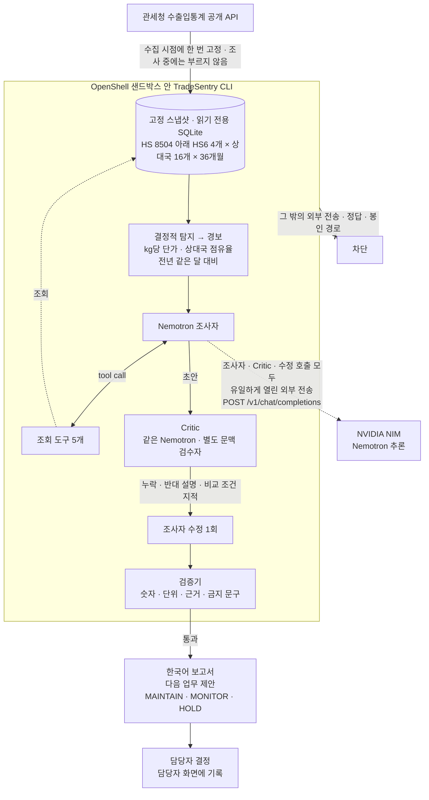
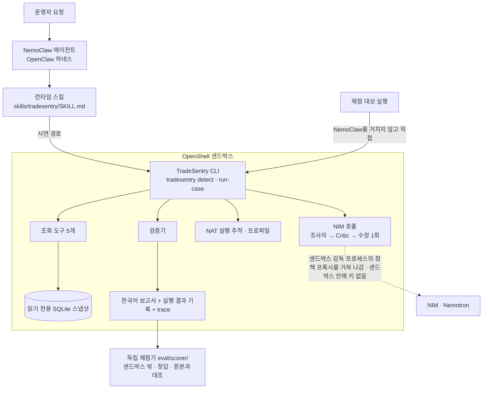
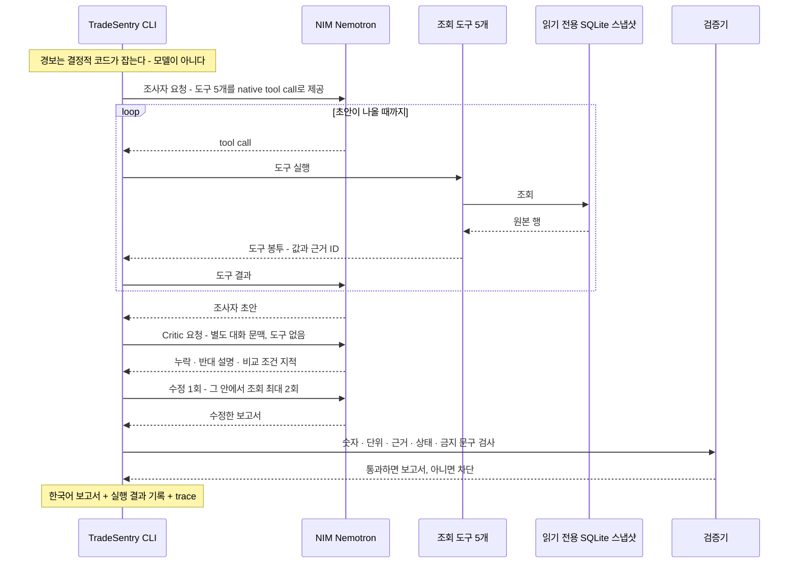
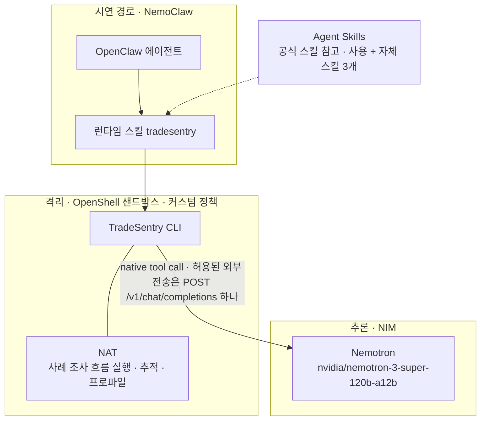
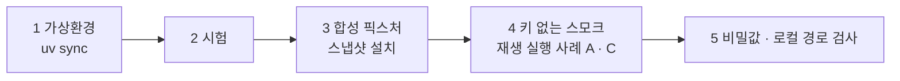
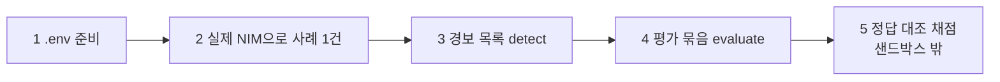
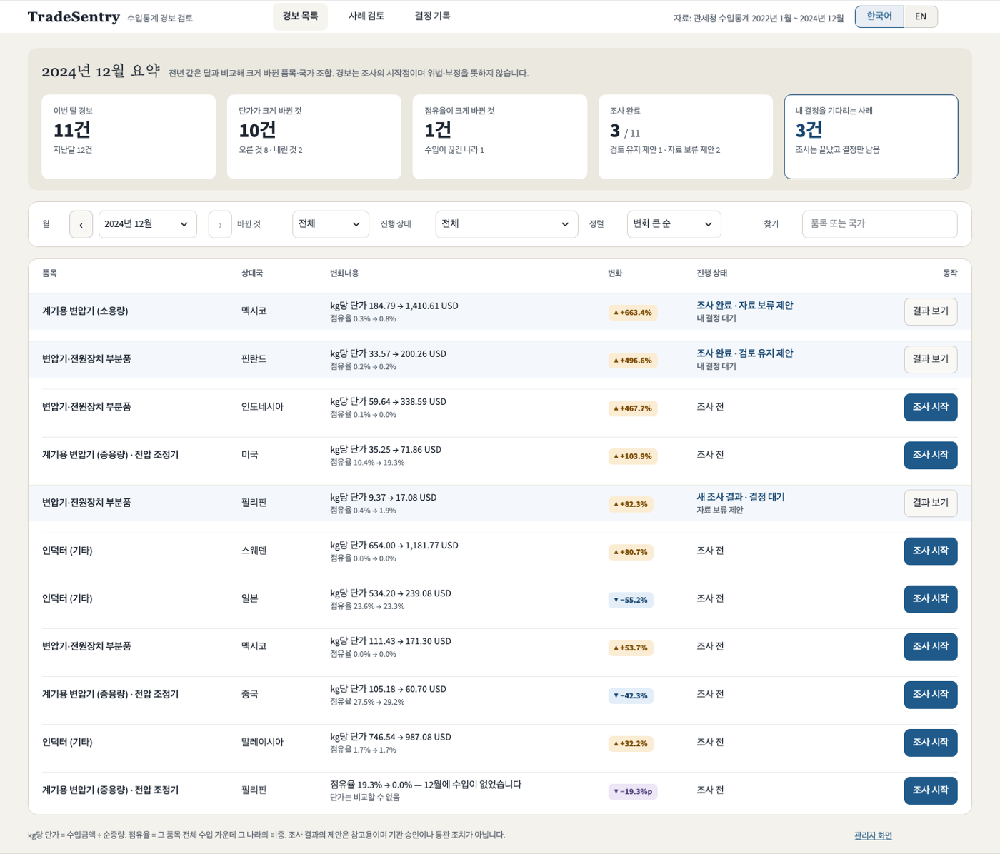
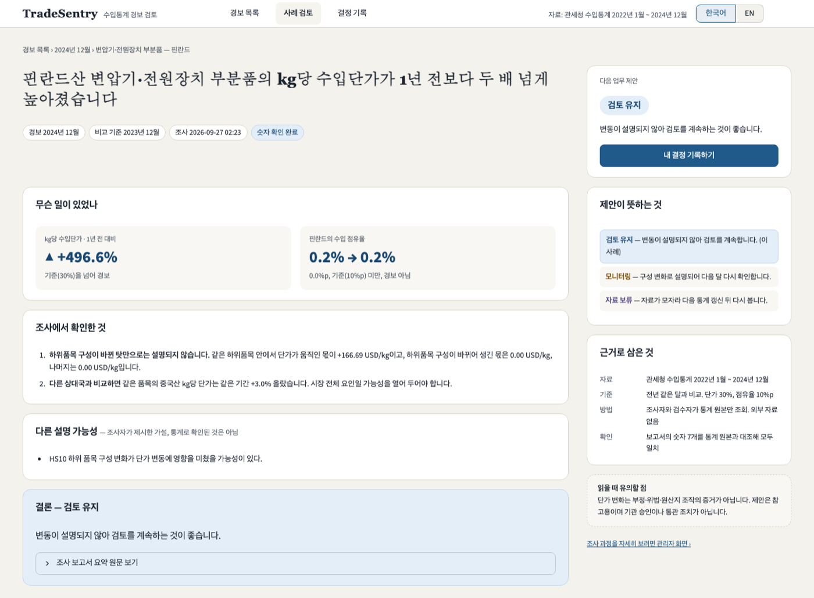
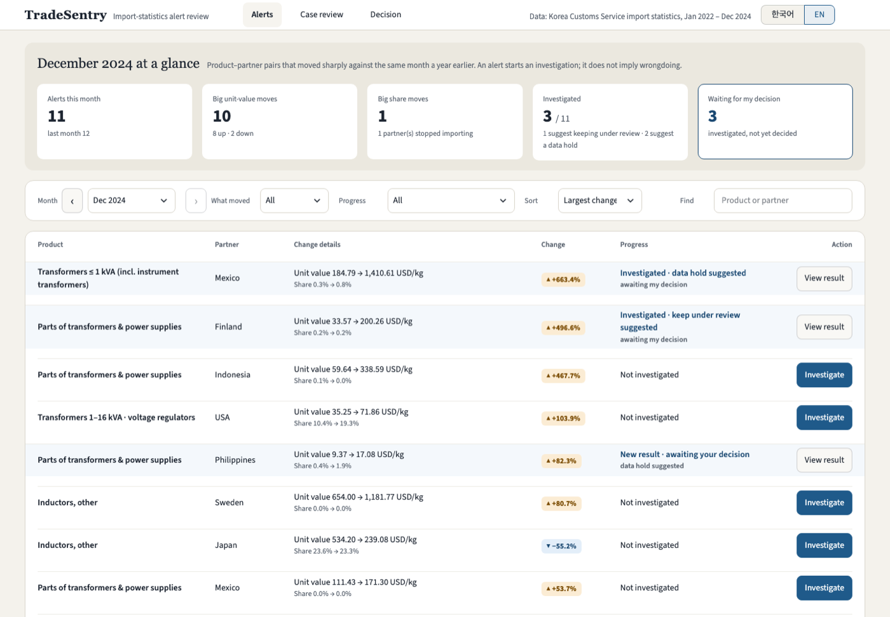

# TradeSentry

[](LICENSE)
[](.python-version)
[](#3-nvidia-스택)
[](#3-nvidia-스택)
[](#3-nvidia-스택)
[](#3-nvidia-스택)

> **관세청 수입통계 경보를 Nemotron 조사자와 검수자(Critic)가 정해진 조회 도구로 반증해 보고, 담당자의 다음 업무를 제안하는 에이전트 시스템.** 2026 NVIDIA Korea Agentic AI Hackathon 예선 제출물.

**바로가기** · [1 무엇인가](#1-무엇인가) · [2 실행 사슬](#2-실행-사슬) · [3 NVIDIA 스택](#3-nvidia-스택) · [4 5분 재현](#4-5분-재현--키-없이) · [5 키가 있을 때](#5-키가-있을-때-선택) · [6 평가와 결과](#6-평가-방법과-결과-위치) · [7 자료](#7-자료) · [8 저장소 구조](#8-저장소-구조) · [9 보안](#9-보안비밀값-규칙) · [10 만든 방법](#10-팀과-만든-방법) · [11 라이선스](#11-라이선스) · [English](#english-summary)

**한눈에 보기** — 경보 하나가 담당자의 결정까지 가는 길. 점선은 샌드박스 밖으로 나가는 유일한 외부 전송(NIM 추론 요청)이다.



평가 결과(대표 지표 두 모드의 값과 Wilson 95% 구간, 등급 표시)는 [6절](#6-평가-방법과-결과-위치)에 있다.

## 1. 무엇인가

TradeSentry가 경보 하나를 다루는 순서:

| 단계 | 하는 일 |
|---|---|
| 1. 경보 | 관세청 수출입통계 공개 API를 한 시점에 수집해 고정한 스냅샷(HS(국제 품목분류 코드) 8504 아래 6자리 품목(HS6) 4개 × 상대국 16개 × 2022~2024년 36개월)에서, **kg당 단가**(금액 USD ÷ 순중량 kg)와 **상대국 점유율**(해당국 금액 ÷ 전체국가 금액)이 전년 같은 달보다 크게 바뀐 경우를 경보로 잡는다 |
| 2. 조사 | 경보마다 Nemotron(NVIDIA 언어 모델) **조사자**가 조회 도구 5개(`check_comparability`, `get_history`, `compare_partners`, `decompose_hs`, `verify_evidence`)로 근거를 모아 초안을 쓴다 |
| 3. 검수 | 별도 문맥의 **Critic**(초안의 누락·반대 설명·비교 조건을 지적하는 검수자 역할. 같은 모델을 다른 대화 문맥으로 쓴다)이 지적한 뒤 수정 1회를 거친다 |
| 4. 검증 | **검증기**(보고서의 숫자·단위·근거 ID를 스냅샷 원본과 대조하는 코드)가 잘못된 보고서를 막는다 |
| 5. 제안 | 통과한 한국어 보고서가 담당자의 다음 업무를 셋 가운데 하나로 제안한다 |

**다음 업무 제안 3종**

| 제안 | 이름 | 뜻 |
|---|---|---|
| `MAINTAIN` | 검토 유지 | 경보가 설명되지 않아 계속 검토한다 |
| `MONITOR` | 모니터링 | 하위품목 구성 변화 같은 산술적 설명이 성립한다 |
| `HOLD` | 자료 보류 | 결측·불일치·분모 부족으로 판단할 자료가 모자란다 |

**하는 일과 하지 않는 일**

| | 하는 일 | 하지 않는 일 |
|---|---|---|
| **판단의 성격** | 경보를 반증해 보고 담당자의 다음 업무를 제안한다 | **아닌 것**: 부정·위법·원산지 판정이나 실제 통관 조치가 아니다 |
| **쓰는 사람** | 수혜자(무역통계·관세 분석 담당자)를 가정한다 | 수혜자는 가상이며 실제 기관이 쓰는 시스템이 아니다 |
| **범위** | 한 사람이 로컬에서 돌리고 추론만 NVIDIA 클라우드 API를 쓰는 데모다 | 여러 사용자·계정·권한·실시간 수집·운영 배포는 없다 |

**증명하려는 한 문장**

> "Nemotron이 숫자를 직접 쓴 조사 보고서보다, 검증된 값만 틀에 채우고 검증기로 막는 TradeSentry 보고서가 실제 관세청 자료 경보에서 사실 주장 오류율이 낮다." (`docs/eval/RULEBOOK.md` Part B)

선행 사례 조사·도입 시나리오·NVIDIA 생태계 편입 경로·한국 맥락 논증은 `docs/plan/DEV_PLAN.md` §14에 있다.

## 2. 실행 사슬

**구성요소가 이어지는 길** — 시연은 NemoClaw를 거치고, 점수에 들어가는 채점 대상 실행은 OpenShell 안 CLI를 직접 부른다.



**사례 1건의 조사 순서**(`run-case`, `full` 모드)



<details>
<summary>실행 사슬을 텍스트로 보기</summary>

```
운영자 요청
  → NemoClaw 에이전트(OpenClaw 하네스)
    → 런타임 스킬 skills/tradesentry/SKILL.md
      → OpenShell 샌드박스 안 TradeSentry CLI  (tradesentry detect | run-case)
          ├─ NIM(Nemotron) 호출: 조사자 → Critic → 수정 1회
          │    (요청은 샌드박스 감독 프로세스의 정책 프록시를 거쳐 나간다. 샌드박스 안에 키 없음)
          ├─ 조회 도구 5개 → 읽기 전용 SQLite 스냅샷
          ├─ NAT 실행 추적·프로파일
          └─ 검증기 → 한국어 보고서 + 실행 결과 기록 + trace
  → (샌드박스 밖) 독립 채점기 eval/scorer/ 가 정답·원본과 대조
```

</details>

**사례당 한도**(모두 조정값이며 모든 모드에 같게 쓴다. 정본 `docs/rules/DATA_CONTRACT_V1.md` §5.3·§8.1)

| 한도 | 값 |
|---|---|
| 모델 요청 | 10회(재전송 제외) |
| 누적 토큰(입력 + 출력) | 128,000 |
| wall time(실제 경과 시간) | 300초 |
| 도구 호출 시도 `tool_attempts` | 8 이하(기본 경로 ≤5, 재조회 ≤2, 최종 검증 1) |
| 재조사(수정 단계) | 1회. 그 안에서 조회는 최대 2회. Critic은 도구를 부르지 않는다 |

**비교 모드 4개** — `freeform`과 `full`은 처리 방식만 다르고 조사자·Critic·도구·예산·자료가 같다.

| 모드 | 무엇 |
|---|---|
| `checklist` | 모델 없이 고정 절차 |
| `agent` | Critic 없는 Nemotron |
| `full` | 전체 TradeSentry |
| `freeform` | 대표 지표의 기준선. 값을 모델이 직접 쓰고 검증기는 기록만 한다 |

- 점수에 들어가는 **채점 대상 실행**은 NemoClaw를 거치지 않고 OpenShell 안 CLI를 직접 부른다. NemoClaw 경로는 시연과 스킬 호출 성공률로 따로 증명하며 정확도 지표에 영향을 주지 않는다.
- 정본: `docs/architecture.md`(실행 사슬), `docs/plan/DEV_PLAN.md` §3~§7(구성요소·정책 요건·조사와 판정 규칙).

<details>
<summary>용어</summary>

| 용어 | 뜻 |
|---|---|
| **NemoClaw** | OpenShell 위에서 OpenClaw(에이전트 실행 틀, 하네스) 에이전트를 돌리는 NVIDIA 참조 스택 |
| **OpenShell** | YAML 정책으로 파일시스템·네트워크·프로세스를 통제하고 허용·차단을 감사 로그로 남기는 NVIDIA 샌드박스 런타임 |
| **NIM** | NVIDIA의 OpenAI 호환 클라우드 추론 API |
| **NAT** | NVIDIA NeMo Agent Toolkit(에이전트 실행을 추적·프로파일·평가하는 도구 모음) |
| **Agent Skills** | `SKILL.md`(이름·설명 머리말과 절차 본문)로 에이전트에게 작업 방법을 주는 형식 |
| **trace** | 실행 추적 기록(JSONL) |

</details>

## 3. NVIDIA 스택



| 구성요소 | 역할(어디에 쓰는가) | 이 프로젝트에서 쓰는 곳(저장소 안 근거) |
|---|---|---|
| **NIM / Nemotron** | 조사자·Critic 추론. 모델 `nvidia/nemotron-3-super-120b-a12b`, 엔드포인트 `https://integrate.api.nvidia.com/v1/chat/completions`, native tool call(모델이 도구 호출을 구조화된 형식으로 요청하는 기능)로 도구 5개를 부름 | `configs/model/model.json`(모델 ID·엔드포인트·요청 설정·사례당 한도), `configs/model/*.txt`(조사자·Critic 지침), `scripts/g4_nim_toolcall_probe.py`(tool call 왕복 확인) |
| **OpenShell** | 채점 대상 실행을 격리. 커스텀 정책으로 정답·봉인 경로 차단, 외부 전송은 NVIDIA 추론 엔드포인트의 `POST /v1/chat/completions` 하나만, 그것도 정책에 지정한 실행 파일에서만 허용(목록은 `configs/openshell/policy.yaml`), 샌드박스 안 키 비보유. 의도적 위반 시험표와 감사 로그 발췌를 커밋 | `configs/openshell/policy.yaml`(정책), `configs/openshell/image/`(샌드박스 이미지 정의), `scripts/openshell_violation_tests.py`, 증거 `artifacts/openshell/openshell_violation_tests-*/`(예측·실측 대조표 `.md`, `audit_log-*.txt`, `live_policy-*.yaml`), X1 기록 `artifacts/openshell/violation_tests.md`·`artifacts/openshell/logs/` |
| **NemoClaw** | 시연 경로. OpenClaw 에이전트가 런타임 스킬을 읽고 샌드박스 안 CLI를 부른다 | `skills/tradesentry/SKILL.md`, `configs/openshell/policy_demo_network.yaml`(시연 샌드박스 네트워크 정책), 결정 기록 `docs/tracking/decisions/20260925-0530-model-decision-mt5-sandbox.md`, `spikes/x1/README.md`(첫날 통합 시험 X1 재현 절차) |
| **NAT** (`nvidia-nat` 1.9.0, `nvidia-nat-profiler`) | 사례 조사 흐름 1건을 NAT 함수로 등록해 실행·추적·프로파일. 추적은 파일로만 남긴다 | `configs/nat/workflow.yml`, `src/tradesentry/workflow/nat_wrap.py`, 실행마다 `outputs/{실행명}/workflow_nat_wrap-*/`(`nat_trace.jsonl`, `workflow_profiling_metrics.json` 등) |
| **Agent Skills** | 공식 스킬(`NVIDIA/OpenShell`의 `generate-sandbox-policy`·`openshell-cli`·`debug-inference`, `NVIDIA/skills`의 `nemoclaw-user-guide`·`skill-card-generator`)을 개발 환경에 설치해 참고·사용했고(`skill-card-generator`로 자체 스킬 3개의 거버넌스 카드를 생성·검증. 스킬별 사용 기록은 스킬 사전 상태 열), 자체 스킬 3개를 둔다 | `docs/eval/SKILL_DICTIONARY.md`(이름·설치 명령·사용 기록·상태), 자체 스킬 `skills/tradesentry/`(런타임), `skills/tradesentry-eval/`(성능 평가 절차), `skills/tradesentry-scorecard/`(자기채점 절차) |

스킬별 실제 사용 기록과 `[미확인]` 표시는 `docs/eval/SKILL_DICTIONARY.md` §1 상태 열이 정본이다.

## 4. 5분 재현 — 키 없이



요구 사항: Python 3.12(저장소의 `.python-version`), uv(파이썬 패키지·가상환경 관리 도구). 네트워크·API 키는 필요 없다. 아래 명령은 모두 저장소 루트에서 돌린다. 이 절의 명령은 2026-09-26(토) 깨끗한 작업 폴더에서 돌려 종료 코드 0을 확인하고 옮겨 적은 것이다(확인 기록은 결정 기록 `docs/tracking/decisions/20260926-0230-model-decision-smoke-replay.md`).

```bash
# 1) 가상환경(.venv/)을 lock대로 만든다
uv sync --locked

# 2) 시험 (네트워크·키 없이 돈다. 키 변수를 지운 환경에서 돌리는 것이 규칙이다)
env -u NVIDIA_API_KEY -u DATA_GO_KR_SERVICE_KEY -u TRADESENTRY_SEALED_DIR \
  uv run --locked python -m unittest discover -s tests

# 3) 합성 픽스처 스냅샷 설치 (한 번. 커밋된 생성 규칙·manifest·빌드 기록에서 SQLite를 만든다)
uv run --locked python -c "from tradesentry.snapshot import fixture; fixture.materialize()"

# 4) 키 없는 스모크 재현: 기록된 모델 응답을 재생해 run-case가 끝까지 돈다 (사례 A)
uv run --locked tradesentry run-case --snapshot controlled_fixture_v0 --policy policy_v1 --mode full \
  --case 850450-XA-202412 --replay eval/dev/smoke/850450-XA-202412.json

# 4') 사례 C
uv run --locked tradesentry run-case --snapshot controlled_fixture_v0 --policy policy_v1 --mode full \
  --case 850432-XC-202412 --replay eval/dev/smoke/850432-XC-202412.json

# 5) 비밀값·로컬 경로 검사 (추적 파일 전체)
uv run --locked python scripts/secret_scan.py
```

기대 결과

- 2) 마지막 줄이 `OK (skipped=N)`이고 종료 코드 0. 건너뛴 시험은 돈 시험으로 세지 않는다.
- 3) 표준 출력 한 줄 `controlled_fixture_v0: 단위 S3 검증 통과, normalized_sha256 …, 새로 쓴 파일 3건, 실행 폴더 outputs/snapshot_fixture-{시각}/`. `data/snapshots/controlled_fixture_v0/`에 `snapshot.sqlite`·`snapshot_build.sqlite`·`raw/`가 생긴다(모두 `.gitignore` 대상). 이미 있으면 대조·검증만 한다.
- 4) 종료 코드 0. 표준 오류에 알림 한 줄 **"알림: --replay로 기록된 모델 응답을 재생한 실행이다(NIM을 부르지 않았다). 점수표 근거가 아니다."** 표준 출력에 실행 폴더 `outputs/run_case-{시각}/`의 파일 4개가 적힌다.

  | 파일 | 내용 |
  |---|---|
  | `runlog_run_record-{시각}.json` | 실행 결과 기록. 사례 A는 `execution_status` `COMPLETED`, `review_status_final` `MONITOR`; 사례 C는 `COMPLETED`, `HOLD` |
  | `reports_render_ko-{시각}.json` | 검증을 통과한 한국어 보고서(`narrative`, `hypotheses`, typed claim(정해진 필드에 담는 사실 주장) 목록) |
  | `runlog_trace-{시각}.jsonl` | trace. 모델 요청·응답, 도구 봉투, 검증기 결과, 코드가 덧붙인 주장 |
  | `workflow_nat_wrap-{시각}/` | NAT 추적 `nat_trace.jsonl`과 프로파일 결과 |

  재생은 기록된 NIM 응답을 차례로 내주며 요청 본문의 해시가 기록과 같은지 대조한다. 도구 5개는 재생 때도 합성 픽스처에서 실제로 돈다. 지침·요청 구성이 바뀌면 해시 불일치로 종료 코드 1이 나고, 그때는 실제 NIM 실행으로 재생 파일을 다시 만든다(`scripts/make_smoke_replay.py`). 세 사례(A `850450-XA-202412`, B `850431-XB-202412`, C `850432-XC-202412`)의 재생 파일이 모두 `eval/dev/smoke/`에 있다.
- 5) `추적 파일 N개, 걸린 곳 0`, 종료 코드 0.

정본: `docs/operations.md`(처음 준비·키 없는 스모크 항목), 결정 기록 `docs/tracking/decisions/20260926-0230-model-decision-smoke-replay.md`.

## 5. 키가 있을 때 (선택)



1. `.env.example`을 `.env`로 복사하고 `NVIDIA_API_KEY`(NIM), 수집을 다시 할 때만 `DATA_GO_KR_SERVICE_KEY`(공공데이터포털)를 넣는다. `.env`는 커밋하지 않고, 키 값은 어떤 문서·로그·trace에도 적지 않는다. 실행 프로세스가 환경변수로 읽는다.
2. 실제 NIM으로 사례 1건: `uv run --locked tradesentry run-case --snapshot controlled_fixture_v0 --policy policy_v1 --mode full --case 850450-XA-202412` (`--replay` 없이).
3. 경보 목록: `uv run --locked tradesentry detect --snapshot controlled_fixture_v0 --policy policy_v1`.
4. 평가 묶음(모드 전부를 한 묶음으로): `uv run --locked tradesentry evaluate --snapshot dev20 --policy policy_v1` → 출력 `outputs/evaluate-{시각}/`.
5. 정답 대조 채점(샌드박스 밖, 키 변수를 뺀 환경에서): `env -u NVIDIA_API_KEY -u DATA_GO_KR_SERVICE_KEY uv run --locked python -m eval.scorer --run outputs/evaluate-{시각}` → 출력 `outputs/score-{시각}/`(`scorer_results-*.jsonl`, `scorer_claims-*.jsonl`, `scorer_summary-*.md`).

OpenShell 샌드박스 안 실행(이미지 스테이징, 정책 적용, 위반 시험, 내려받기)과 NemoClaw 시연 절차는 되풀이하지 않는다. `docs/operations.md`, `docs/plan/DEV_PLAN.md` §4·§5, `skills/tradesentry-eval/SKILL.md`를 따른다. 실자료 스냅샷 `kcs_202201_202412_v2`의 SQLite는 커밋하지 않으므로 실자료 실행에는 수집기(`src/tradesentry/ingest.py`)로 다시 수집하거나 빌드 기록과 대조한 사본이 필요하다.

### 화면(선택)

Streamlit(파이썬 웹 화면 라이브러리) 앱 하나에 페이지 4개가 있다: 담당자용 화면 3개와 관리자용 화면 1개(기존 화면 1 "사례 보기").

| 경보 목록(담당자 화면) | 사례 검토(담당자 화면) |
|---|---|
|  |  |

실자료 스냅샷으로 띄운 담당자 화면이다. 화면에서 시작한 실행·재생 실행·결정 기록은 점수표 근거가 아니다. 부정·위법·원산지 판정이나 실제 통관 조치가 아니다.

<details>
<summary>영어 모드 화면(EN)</summary>



</details>

<details>
<summary>페이지별 설명(경보 목록 · 사례 검토 · 결정 기록 · 관리자 화면)</summary>

- **경보 목록**: 요약 카드 띠(이번 달 경보·지난달, 단가가 크게 바뀐 것(오른 것·내린 것), 점유율이 크게 바뀐 것, 조사 완료(제안별), 내 결정을 기다리는 사례), 조회 조건 카드(월·바뀐 것·진행 상태·정렬(변화 큰 순 기본)·찾기), 데이터 표 6열(품목·상대국·변화내용·변화·진행 상태·동작). 경보 목록은 CLI `detect`와 같은 함수로 만들고 지표는 조회 도구 봉투의 값을 그대로 옮긴다.
- **사례 검토**: 조사 결과를 평이한 문장으로 옮긴 설명(무슨 일이 있었나 → 조사에서 확인한 것 → 다른 설명 가능성 → 결론, 보고서 요약 원문은 접힌 상태)과 "다음 업무 제안" 카드, 제안 3종의 뜻, 근거로 삼은 것, 유의할 점. 숫자는 보고서의 claim과 trace 지표에서만 옮긴다.
- **결정 기록**: 담당자 결정 기록(모의 승인. 제안대로 또는 다르게, 이유)을 `outputs/approval_record-{시각}/approval_record-{시각}.json`에 추가 전용으로 저장하고, 실행 폴더의 지금 보고서와 대조해 `VALID`/`REVIEW_REQUIRED`를 붙인다(목록에는 "결정 완료"/"재검토 필요"). 같은 사례를 `--mode full`로 다시 도는 "다시 조사", 사후 확인(열리지 않음), 이 사례의 기록, 용어. 실제 기관 승인이나 통관 조치가 아니고 계정·권한은 없다.
- **관리자 화면**(기존 화면 1 "사례 보기"): 실행 폴더 `outputs/run_case-{시각}/` 하나를 골라 사례별 조회 이유(발동 지표와 정책 기준값), 기준월·비교월의 kg당 단가·점유율 차트, 실제 실행한 도구(trace, 실행 추적 기록), 반대 근거와 보고서(typed claim, 코드가 덧붙인 주장 표시), 판정 전후 타임라인(조사 전 경보 → 최종 판정), 원본 행 링크(근거 ID → 스냅샷 행)를 보인다. 사이드바의 "사례 실행" 패널은 CLI와 같은 진입점으로 사례 1건을 돌리고 결과 폴더를 바로 띄운다(키가 없으면 재생 파일이 있는 합성 사례의 재생 실행만 된다). 화면은 기록을 보여 줄 뿐 판정·지표를 다시 계산하지 않고, 화면에서 시작한 실행과 재생 실행은 점수표 근거가 아니다.

담당자 화면에는 사이드바가 없고 머리 띠(페이지 링크 3개·자료 기간·언어 한국어/EN)로 움직인다. HS6 코드·스냅샷 ID·실행 폴더 이름·정책 이름·상태 코드 같은 내부 식별자는 담당자 화면에 보이지 않는다(예외: 결정 기록의 "문의할 때 사례 번호" 한 줄). 담당자 화면이 쓸 스냅샷은 관리자 화면 사이드바의 "담당자 화면 자료(스냅샷)"에서 고른다(기본은 정본 빌드가 있는 실자료). "조사 시작"·"다시 조사"는 배경 하위 프로세스로 돌고, 화면 전체를 덮는 로딩 창이 trace에서 읽은 5단계(자료 확인 → 이력·상대국 비교 → 하위품목 구성 → 검수·수정 → 숫자 대조)를 보인다. "목록으로"를 누르면 조사는 계속되고 모든 화면(관리자 화면 포함) 오른쪽 아래에 "조사 중" 표시가 떠 누르면 로딩 창이 다시 열리며, 끝나면 "조사 완료 · 결과 보기"로 바뀐다. 영어 모드에서도 보고서 요약(`narrative`)·가설(`hypotheses`) 원문은 한국어 그대로 두고 "(Korean original)"을 붙인다.

</details>

```bash
uv run --locked --with "streamlit==1.64.0" streamlit run src/tradesentry/ui/ui_app.py --client.showErrorDetails=false   # 담당자용 화면 + 관리자용 화면. streamlit은 lock 밖(--with)에서 받는다. 브라우저 http://localhost:8501(다른 포트는 --server.port)
uv run --locked --with "streamlit==1.64.0" streamlit run src/tradesentry/app.py --client.showErrorDetails=false   # 기존 화면 1(관리자용)만 띄울 때
```

앱은 `.env`를 읽지 않는다. 실제 NIM 실행은 Streamlit(파이썬 웹 화면 라이브러리) 프로세스 환경에 `NVIDIA_API_KEY`가 있을 때만 된다(예: `python3 spikes/x1/with_nvidia_key.py --env-file .env -- uv run --locked --with "streamlit==1.64.0" streamlit run src/tradesentry/app.py --client.showErrorDetails=false`. 담당자용 화면도 같은 규칙이며 진입 스크립트만 `src/tradesentry/ui/ui_app.py`로 바꾼다). `outputs/sealed/`(봉인 묶음 출력)는 나열·표시하지 않는다. 화면에서 시작한 실행·재생 실행·결정 기록은 점수표 근거가 아니다. 정본: `docs/operations.md`("화면 1 실행"·"담당자용 화면 실행"), 결정 기록 `docs/tracking/decisions/20260926-0732-model-decision-ui-screen-1.md`(화면 1), `docs/tracking/decisions/20260926-1836-model-decision-ui-user-pages.md`·`docs/tracking/decisions/20260926-2031-model-decision-ui-user-pages-v2.md`(담당자용 화면·v2. 사용자 결정 `docs/tracking/decisions/20260926-1828-user-decision-user-pages-and-review-fallback.md`).

## 6. 평가 방법과 결과 위치

정본은 평가 룰북 `docs/eval/RULEBOOK.md` Part B다. 요지만 적는다.

- **대표 지표**: 봉인한 실자료 묶음 `real_sealed`에서 `freeform` 대 `full`의 **보고서 단위 사실 주장 오류율**.
  - 대조 방법: typed claim의 모든 필드(숫자·단위·증감 방향·기간·국가·품목·지표·근거 ID)와 설명 문장 속 숫자·증감 표현을 공식 통계 원본(스냅샷 원본 행)과 결정적으로 대조한다.
  - 사람 판정자도 AI 채점자도 두지 않는다.
  - 숫자·증감이 없는 정성 서술의 의미 정확성은 범위 밖이다.
- **보조 지표**: 봉인한 합성 묶음 `holdout40`에서 `checklist`·`agent`·`full`의 근거 충족 처리정확도, 불필요 보류율, 잘못된 모니터링률, 혼동행렬, 실행 실패 수, 비용.
  - 코드가 필수 근거 주장을 덧붙이는 규칙이 있으므로, 근거 충족 처리정확도는 "모델이 필수 근거를 스스로 챙기는가"가 아니라 **"시스템이 보고서에 필수 근거를 보이는가"**를 잰다(룰북 B4).
- **숫자 등급**(룰북 A5): 비율마다 Wilson 95% 구간을 붙이고, 구간이 겹치면 차이를 주장하지 않는다.

  | 등급 | 뜻 |
  |---|---|
  | A | 실제 라벨(대표 지표, `real_sealed`) |
  | B | 한 번만 평가한 held-out |
  | C | 독립적으로 만든 결정적 픽스처(`holdout40`) |
  | D | 우리가 만들고 우리가 채점한 개발 자료(`dev20`, `real_dev`) |

- **동결과 봉인**:
  - 룰북 `RB-1` 동결 뒤에는 채점 규칙·판정 정책·검증기·채점기를 결과를 보고 유리하게 고치지 않는다.
  - 봉인 묶음은 한 번만 채점하고 실패·시간 초과·무효 실행도 분모에 남긴다.
  - 봉인 자료는 채점이 끝날 때까지 저장소 밖에 두고 해시만 커밋했으며(`eval/sealed_manifest.json`), 최종 채점과 표본 추출 seed 공개 뒤 원본을 `eval/sealed/`에 커밋했다.
- **독립 채점기** `eval/scorer/`: 런타임 패키지를 import하지 않고, 모델·네트워크·하위 프로세스를 쓰지 않는다. 명령은 `python -m eval.scorer --run <run_dir>`.
- **`real_dev`에서 본 실패 유형으로 조사 지침과 흐름을 조정했다.** 그래서 `real_dev` 값은 개발 값이다.

### 핵심 숫자

2026-09-26(토) 봉인 채점. 결과표 `docs/eval/RESULTS.md`에서 글자 그대로 옮겼다. 룰북 `RB-1` 동결 커밋 c557540, `code_version` d35fe75, 정책 `policy_v1`, 비교국 `g0`.

| 묶음 | 모드 | 지표 | x/N (Wilson 95%) | 등급 |
|---|---|---|---|---|
| `real_sealed`(실자료 40사례) | `freeform` | 보고서 단위 사실 주장 오류율 | 11/40 = 27.5% (16.1%~42.8%) | A등급 주장 보류(참고치) |
| `real_sealed`(실자료 40사례) | `full` | 보고서 단위 사실 주장 오류율 | 0/40 = 0.0% (0.0%~8.8%) | A등급 주장 보류(참고치) |
| `holdout40`(합성 40사례) | `checklist` | 근거 충족 처리정확도 | 38/40 = 95.0% (83.5%~98.6%) | 등급 C |
| `holdout40`(합성 40사례) | `agent` | 근거 충족 처리정확도 | 38/40 = 95.0% (83.5%~98.6%) | 등급 C |
| `holdout40`(합성 40사례) | `full` | 근거 충족 처리정확도 | 35/40 = 87.5% (73.9%~94.5%) | 등급 C |

- **`real_sealed` 해석**:
  - 두 모드는 구간이 겹치지 않아 `full`의 보고서 단위 오류율이 "낮다"(룰북 B4 1차 규칙).
  - 보조 분석: Newcombe 짝 차이 95% 구간(`freeform` − `full`) +13.1pp~+42.8pp, McNemar 정확 검정 p 0.001.
  - 실행 실패는 `freeform` 4(FAILED 2·INVALID 2), `full` 0이며 분모에 남겼다.
  - 사례 40건은 서로 다른 시계열 27개에서 나와 Wilson 구간의 독립 가정이 약하다.
- **이 README와 제출 문구는 등급 A를 주장하지 않는다.**
  - 채점기의 A등급 주장 조건(룰북 B3-3) 자동 판정이 조건 3(채점기 사전 검증)을 실행 조건 입력 파일의 형식 오류로 미충족으로 적었고, 봉인 묶음은 한 번만 채점하므로 재채점하지 않았다.
  - 조건별 판정과 실질 근거는 결과표 §1.1에 있다. 대표 지표 값은 참고치다.
- **`holdout40` 해석**: 세 비교군의 구간은 서로 겹쳐 차이를 주장하지 않는다(모두 보류 기준선 16/40 = 40.0% (26.3%~55.4%)). 합성 자료라 등급 C다.

### 결과 위치

| 무엇 | 어디 |
|---|---|
| 결과표(대표 숫자 `real_sealed`, 보조 숫자 `holdout40`, A등급 주장 조건 판정, 룰북 B7 공개 값, 한계) | `docs/eval/RESULTS.md`(로드맵 R1). 숫자는 아래 두 채점 요약에서만 옮겼다 |
| 봉인 묶음 채점 요약(커밋 사본) | `real_sealed`: `artifacts/eval/score-260926135136/scorer_summary-260926135136.md`, `holdout40`: `artifacts/eval/score-260926115824/scorer_summary-260926115824.md`. 같은 폴더에 `scorer_results-*.jsonl`, `scorer_claims-*.jsonl`, 재채점용 보고서 원문 `run_case-*/` |
| 봉인 원본(입력·정답표·사례 목록·표본·표본 추출 seed) | `eval/sealed/`(최종 채점과 seed 공개 뒤 커밋, 해시 목록 `eval/sealed_manifest.json`과 전체 재대조) |
| 개발 묶음(`dev20`·`real_dev`) 채점 요약 | `artifacts/eval/score-*/scorer_summary-*.md`. 개발 묶음 값이며 **대표 숫자가 아니다**(등급 D). 같은 폴더에 `scorer_results-*.jsonl`, `scorer_claims-*.jsonl`, 재채점용 보고서 원문 `run_case-*/` |
| OpenShell 정책 적용·위반 시험 증거 | `artifacts/openshell/openshell_violation_tests-*/` |
| 자기채점(룰북 Part A, 팀 채점 규범 `docs/research/SCORING_GOLDEN_RULE.md` 기준) | `artifacts/scorecard/scorecard-*/scorecard-*.md` |
| 개발용 기대 판정 사례 A·B·C | `eval/dev/oracle_ABC.json` |
| 합성 시나리오 명세(공개) | `eval/scenarios/SCENARIO_SPEC.md` |

## 7. 자료

- **실자료**: 관세청 수출입통계 공개 API(공공데이터포털 data.go.kr `15100475` 국가별, `15101609` 품목별).
  - **스냅샷**: 수집 시점에 고정한 스냅샷 `kcs_202201_202412_v2`(HS 8504 아래 HS6 4개 × 상대국 16개 × 2022-01~2024-12 36개월. 판정 가능한 달은 전년동월이 있는 2023-01~2024-12).
  - **설정·기록**: 수집 설정은 `configs/collection_plan.json`, 수집 요청 목록(manifest)·검사 결과는 `data/snapshots/kcs_202201_202412_v2/`.
  - **커밋 범위**: **원자료(API 응답)와 SQLite는 커밋하지 않고** 해시·빌드 기록만 커밋한다. 동결한 스냅샷은 고치지 않고, 설정이 바뀌면 새 `snapshot_id`로 만든다.
  - **이용 조건**: 자료 이용 조건은 위 두 공개 안내 페이지에 적힌 조건을 따르며, 저장소에는 원자료를 재배포하지 않는다. 조사 중에는 API를 부르지 않는다.
- **합성 자료**: 합성 사례의 상대국 코드(`XA`·`XB`·`XC`·`XO` 등)는 가상이다.

  | 이름 | 내용 |
  |---|---|
  | `controlled_fixture_v0` | 정답을 알고 만든 개발·시험용 픽스처. 사례 A 구성변화·B 잔존변화·C 자료누락 |
  | `dev20` | 공개 개발 자료 20건, `eval/dev/dev20/` |
  | `holdout40` | 봉인 평가 자료 40건. 채점이 끝날 때까지 저장소 밖에 두었고, 최종 채점 뒤 `eval/sealed/`에 커밋했다 |

- **참고 자료**: `data/reference/` — 품목표, 관세청 국가코드, 비교국 표(`peer_group_g0.csv`), 실자료 분할 기록(`real_split_kcs_202201_202412_v2.json`), BACI(CEPII가 정리한 국가 간 연간 무역 자료) 발췌. BACI는 비교국 선택과 문맥 표시에만 쓰고 관세청 지표와 한 지표 안에서 섞지 않는다.
- **출처와 이용 조건**(2026-09-26(토) 각 원 페이지에서 확인):

  | 자료(원 페이지) | 이용 조건 | 저장소 파일 |
  |---|---|---|
  | 관세청 품목별 국가별 수출입실적(GW) API(https://www.data.go.kr/data/15100475/openapi.do)와 관세청 품목별 수출입실적(GW) API(https://www.data.go.kr/data/15101609/openapi.do) | 이용허락범위 제한 없음 | 조회 코드표 `data/reference/관세청조회코드_v1.3.xlsx`는 두 번째 API 페이지의 참고문서이고, 관세청 국가코드 `data/reference/kcs_country_codes.json`은 이 코드표의 "국가코드" 시트를 옮긴 것이다 |
  | 관세청_HS부호_20260101(https://www.data.go.kr/data/15049722/fileData.do) | 공공저작물 출처표시(공공누리 제1유형). 출처: 관세청, 공공데이터포털 | `data/reference/관세청_HS부호_20260101.xlsx`와 여기서 뽑은 품목표에 해당한다 |
  | BACI HS22 V202601(CEPII, https://www.cepii.fr/CEPII/en/bdd_modele/bdd_modele_item.asp?id=37) | Etalab 2.0 공개 라이선스(프랑스 정부의 공개 라이선스. 출처를 밝히면 복제·수정·재배포할 수 있다) | `data/reference/baci_hs22_v202601_kr_imports_ch85.csv`는 한국 수입 85류 발췌다 |

  BACI 인용: Gaulier, G. and Zignago, S. (2010) BACI: International Trade Database at the Product-Level. The 1994-2007 Version. CEPII Working Paper, N°2010-23.
- 자료 형식·상태값·단위·자릿수의 정본: `docs/rules/DATA_CONTRACT_V1.md`.

## 8. 저장소 구조

정본은 `CLAUDE.md`의 문서 구조 표와 `docs/README.md`(문서 색인)다. 요약만 둔다.

```
README.md                      ← 이 문서(심사위원용 안내)
CLAUDE.md / AGENTS.md          ← 에이전트용 프로젝트 안내(내용이 같다)
LICENSE                        ← Apache License 2.0 전문(이 프로젝트의 코드·문서. 제3자 자료는 11절)
docs/
  plan/      DEV_PLAN.md(개발 플랜) · ROADMAP.md(작업·날짜·완료 기준) · UNITS.md(최소 단위 표) · SUBMISSION_SCENARIOS.md
  rules/     DATA_CONTRACT_V1.md(값의 정본) · PARALLEL_DEV_RULES.md · AGENT_OPS.md
  eval/      RULEBOOK.md(평가 룰북) · RESULTS.md(결과표) · SKILL_DICTIONARY.md(스킬 사전)
  submission/ SUBMISSION_FORM.md(제출 폼 입력용 최종본) · service_file.html(서비스 파일 한 쪽 템플릿)
  architecture.md · business-rules.md · security.md · operations.md · contracts.md · standards.md · engineering-notes.md
  research/  이전 설계·조사 기록(2026-09-27 루트에서 옮김. 인용만 하고 고치지 않는다. 목록은 docs/research/README.md)
  tracking/  status.md · decisions/(결정 기록) · findings.md · journal.md(기획·개발 일지)
src/tradesentry/               ← 앱 패키지(contract·snapshot·dal·metrics·policy·grouping·tools·workflow·reports·validator·runlog·evaluation·approval·cli)와 수집기 ingest.py · ui/(담당자용 화면. 진입 스크립트 ui/ui_app.py, 한국어/영어)
tests/                         ← unittest(네트워크·키 없이 돈다). 단위 골든 시험 tests/units/{단위 ID}/
configs/                       ← model/(모델·지침) · openshell/(정책·이미지) · nat/(NAT 워크플로) · policy_v1.json(판정 정책) · collection_plan.json
skills/                        ← tradesentry(런타임) · tradesentry-eval(성능 평가) · tradesentry-scorecard(자기채점)
eval/                          ← scorer/(독립 채점기) · datagen/(평가 자료 도구) · scenarios/ · dev/(oracle_ABC.json, dev20/, smoke/)
data/snapshots/ · data/reference/  ← 스냅샷 manifest·해시·빌드 기록(SQLite·원자료 제외), 참고 자료
artifacts/                     ← 커밋 증거물: eval/score-*/ · openshell/ · scorecard/
scripts/                       ← secret_scan.py · make_smoke_replay.py · openshell_violation_tests.py · stage_sandbox_image.py · g4_nim_toolcall_probe.py · make_service_file.sh(서비스 파일 pdf·docx 생성)
spikes/x1/                     ← 첫날 통합 시험 X1 임시 코드(앱에 섞지 않는다)
outputs/                       ← 실행별 출력(커밋하지 않는다)
```

## 9. 보안·비밀값 규칙

- **키**:
  - **원본 위치**: `NVIDIA_API_KEY`·`DATA_GO_KR_SERVICE_KEY`의 원본은 `.env`에만 둔다.
  - **넣지 않는 곳**: 키 값은 코드·문서·커밋·PR·로그·trace에 넣지 않는다.
  - **주입 방식**: 샌드박스 프로그램에는 자리표시 값만 있고, 샌드박스 안 감독 프로세스(root로 돌며 정책을 집행하는 OpenShell 프로세스)의 정책 프록시가 게이트웨이에서 받은 자격 증명으로 요청 시점에 실제 키로 바꾼다(credential placeholder rewrite). 에이전트와 그 자식 프로세스가 읽을 수 있는 곳에는 키가 없다.
  - **검사**: 커밋 전 검사는 `scripts/secret_scan.py`(키 모양·로컬 절대 경로).
- **봉인 자료**(개발 중 보지 않도록 저장소 밖 봉인 폴더(환경변수 `TRADESENTRY_SEALED_DIR`가 가리키는 곳)에 두는 `holdout40`·`real_sealed`)와 정답표:
  - 채점이 끝날 때까지 저장소에는 해시만 커밋한다.
  - 정답표는 어떤 샌드박스에도 넣지 않고, 정답 대조 채점은 샌드박스 밖 독립 채점기만 한다.
  - **봉인의 정직한 한계**: 같은 OS 사용자의 열람을 기술적으로 막지 못하며, 실제 통제는 "열지 않는다" 규칙과 봉인 사건 기록이다.
- **동결 스냅샷**: `kcs_202201_202412_v1`·`_v2`에 수집기를 다시 돌리지 않는다.
- **정본**: `CLAUDE.md` 절대 규칙, `docs/security.md`, `docs/rules/PARALLEL_DEV_RULES.md` §6·§10, `docs/plan/DEV_PLAN.md` §4.

## 10. 팀과 만든 방법

- **팀 정보**는 대회 신청 폼(Section 01·02)에 적는다. 이 README에는 두지 않는다.
- **구현**은 Claude 보조 에이전트가 두 트랙으로 나눠 동시에 했다.
  - 모델 트랙: 판정 정책·조사 흐름·NVIDIA 연동
  - 데이터 트랙: 수집·지표·평가 자료·채점기
- **검토**는 작업 성격별 도메인 검토 에이전트와 Codex(OpenAI의 코딩 에이전트 CLI)가 했다.
- **결정**은 `docs/tracking/decisions/`에 남아 있다.

## 11. 라이선스

- **이 프로젝트가 만든 코드와 문서**는 Apache License 2.0(SPDX(소프트웨어 라이선스 표준 식별자) `Apache-2.0`, 특허 조항이 있는 허용형 오픈소스 라이선스)을 따른다. 전문은 저장소 루트의 `LICENSE`다(2026-09-27(일) 사용자 결정, 결정 기록 `docs/tracking/decisions/20260927-0215-user-decision-license-apache2.md`).
- **저장소에 든 제3자 자료**는 Apache-2.0이 아니라 각 출처의 이용 조건을 따른다. 자세한 출처와 조건은 7절 "출처와 이용 조건"이 정본이다.

  | 제3자 자료 | 이용 조건 |
  |---|---|
  | 관세청 수출입실적 API 두 개(공공데이터포털 `15100475`·`15101609`) | 두 API 페이지의 조건은 이용허락범위 제한 없음이다. 조회 코드표 `data/reference/관세청조회코드_v1.3.xlsx`는 두 번째 API 페이지의 참고문서이고, 국가코드 `data/reference/kcs_country_codes.json`은 그 코드표의 "국가코드" 시트를 옮긴 것이다. 원자료(API 응답)는 저장소에 재배포하지 않는다 |
  | 관세청_HS부호_20260101과 여기서 뽑은 품목표 | 공공누리 제1유형(출처표시. 출처: 관세청, 공공데이터포털) |
  | BACI HS22 V202601 발췌(CEPII) | Etalab 2.0 공개 라이선스(출처를 밝히면 복제·수정·재배포 가능). 인용은 7절 |

## English summary

**What it is.** TradeSentry flags year-over-year jumps in unit value (USD/kg) and partner share in a frozen snapshot of Korea Customs Service import statistics (HS 8504, four HS6 items × 16 partners × 36 months, 2022–2024). For each alert, a Nemotron investigator gathers evidence through five fixed query tools, a separately-contexted Critic challenges the draft, one revision follows, and a code validator blocks any report whose numbers, units or evidence IDs do not match the snapshot. The output is a Korean report proposing the analyst's next action: `MAINTAIN`, `MONITOR` or `HOLD`. It is not a fraud, legality or origin determination and does not trigger customs action.

**NVIDIA stack:**

- NIM (`nvidia/nemotron-3-super-120b-a12b` at `https://integrate.api.nvidia.com/v1/chat/completions`, native tool calls)
- OpenShell (custom policy `configs/openshell/policy.yaml`; violation tests and audit logs in `artifacts/openshell/`)
- NemoClaw (demo path via the runtime skill `skills/tradesentry/SKILL.md`)
- NeMo Agent Toolkit 1.9.0 (`configs/nat/workflow.yml`, per-run traces and profiles)
- Agent Skills (official skills listed in `docs/eval/SKILL_DICTIONARY.md`; three in-repo skills under `skills/`)

**Key-less reproduction:** `uv sync --locked`, run the tests, materialize the synthetic fixture, then `tradesentry run-case ... --replay eval/dev/smoke/<case_id>.json` replays recorded model responses end to end (exit code 0; the tool calls run for real against the fixture). See section 4. Evaluation rules are in `docs/eval/RULEBOOK.md` Part B.

**Results** (both sealed sets were scored once on 2026-09-26; rulebook `RB-1` freeze commit c557540, `code_version` d35fe75, policy `policy_v1`, peer group `g0`; numbers copied verbatim from `docs/eval/RESULTS.md`, Wilson 95% intervals in parentheses):

- **Headline metric**, `real_sealed` (40 real-data cases) — report-level factual-claim error rate: `freeform` (baseline: the model writes the numbers itself and the validator only records) 11/40 = 27.5% (16.1%–42.8%); `full` (investigator + Critic + validator blocking) 0/40 = 0.0% (0.0%–8.8%). The intervals do not overlap, so `full` is "lower" (rulebook B4 primary rule). Grade label: A-grade claim withheld (reference values). The scorer's automatic check of the A-grade conditions marked condition 3 (scorer pre-validation) as unmet because of a malformed run-conditions input, and sealed sets are scored only once, so there was no re-scoring. The 40 cases come from 27 distinct time series, which weakens the independence assumption behind the Wilson intervals. The difference measures TradeSentry's processing (only verified values go into the report, and the validator blocks mismatches), not the effect of NVIDIA components.
- **Supporting metric**, `holdout40` (40 synthetic cases, grade C) — evidence-complete processing accuracy: `checklist` 38/40 = 95.0% (83.5%–98.6%), `agent` 38/40 = 95.0% (83.5%–98.6%), `full` 35/40 = 87.5% (73.9%–94.5%). The intervals overlap, so no difference is claimed.
- **Development-set numbers** (`dev20`, `real_dev`, grade D) in `artifacts/eval/score-*/` are not headline numbers.

**UI:** a Streamlit app (entry script `src/tradesentry/ui/ui_app.py`, section 5) with analyst pages in Korean and English and an admin view of each investigation's trace. Anything beyond this single-user local demo (a shared sandbox, monthly snapshot refresh, an always-on daemon that sends push alerts after each batch, GraphRAG, a fine-tuned local model) is a plan only; see the extension section of `docs/submission/SUBMISSION_FORM.md`.

**License:** the code and documentation written for this project are under the Apache License 2.0 (`LICENSE`); third-party data in the repository keeps its own source terms (section 7).
